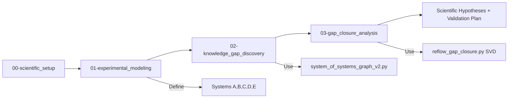

# Scientific Reflow - Knowledge Gap Discovery for Experimental Science

**Version**: 1.0.0
**Framework**: Experimental Scientific Systems (ESS)
**Purpose**: Use graph-based modeling and matrix analysis (SVD) to infer unknown sample properties from beamline/laboratory experiments

---

## 🎯 What is Scientific Reflow?

Scientific Reflow is a **specialized spinoff of Reflow** designed for **scientific discovery** rather than engineering. It helps experimental scientists:

1. **Model experimental apparatus** as a system-of-systems graph (Systems A, B, C, D, E)
2. **Identify knowledge gaps** (System D - the sample/system under investigation)
3. **Infer unknown properties** using graph analysis + matrix-based gap closure (SVD)
4. **Generate scientific hypotheses** from gap closure proposals
5. **Design validation experiments** to test hypotheses

**Key Innovation**: Treats "knowledge gaps" as **DESIRED FEATURES** (not bugs) and uses mathematical inference to discover unknown properties from experimental measurements.

---

## 🧪 The 5-System Model (Experimental Scientific Systems Framework)

Every experiment can be decomposed into 5 systems:

| System | Category | Knowledge State | Role | Beamline Example |
|--------|----------|----------------|------|------------------|
| **System A** | Source | KNOWN | Energy/particle source | Synchrotron undulator, laser, X-ray tube |
| **System B** | Manipulation | KNOWN | Optics/mechanics that condition the beam | Monochromators, mirrors, slits, focusing optics |
| **System C** | Environment | KNOWN | Environmental controls | Temperature (cryostat), pressure (vacuum), magnetic field |
| **System D** | Sample | **UNKNOWN** | The target of discovery | Crystal structure, chemical composition, electronic states |
| **System E** | Detection | KNOWN | Detectors and measurement systems | CCD cameras, spectrometers, photodiodes |

**Data Flow**: A → B → D → E (with C → D)

**Critical Insight**: Systems A, B, C, E are KNOWN (engineered/calibrated). System D is UNKNOWN (scientific target). We **infer D from measurements of D→E** given known A, B, C, E.

---

## 🚀 Quick Start

### Prerequisites

```bash
# Required Python packages
pip install networkx>=3.0 numpy scipy

# Or use Pixi (recommended - 2-5x faster)
pixi install
```

### 3-Step Workflow

```bash
# Step 1: Setup (10-15 min)
"Implement workflow in /path/to/reflow/scientific-reflow/workflows/00-scientific_setup.json
 on system in /path/to/your_experiment"

# Step 2: Model your experimental system (30-60 min)
# → Proceeds automatically to 01-experimental_modeling.json
# → Define Systems A, B, C, D (UNKNOWN), E

# Step 3: Discover knowledge gaps (15-20 min)
# → Proceeds to 02-knowledge_gap_discovery.json
# → Runs system_of_systems_graph_v2.py

# Step 4: Close gaps with SVD (20-30 min)
# → Proceeds to 03-gap_closure_analysis.json
# → Runs reflow_gap_closure.py (matrix transformation + SVD)
# → Generates scientific hypotheses!
```

---

## 📊 Workflow Overview



### Workflow Details

| Workflow | Purpose | Duration | Key Outputs |
|----------|---------|----------|-------------|
| `00-scientific_setup` | Initialize project, define scientific goals | 10-15 min | `working_memory.json`, `scientific_goal.md` |
| `01-experimental_modeling` | Model apparatus as graph (A→B→D→E) | 30-60 min | `experimental_system_architecture.json` |
| `02-knowledge_gap_discovery` | Generate graph, detect gaps (System D) | 15-20 min | `experimental_system_graph.json`, gap report |
| `03-gap_closure_analysis` | Matrix transformation + SVD → infer System D | 20-30 min | `gap_closure_proposals.json`, hypotheses |

**Total Time**: ~1.5-2 hours for complete workflow

---

## 🔬 Example: NSLS2 Beamline X-ray Scattering

### Scientific Goal
Determine the crystal structure of an unknown material using X-ray diffraction.

### System Decomposition

**System A - Source**: Insertion device (undulator)
- Energy: 5-30 keV
- Flux: 10¹³ photons/sec
- Beam size: 100 μm × 50 μm

**System B - Manipulation**:
- Double Crystal Monochromator (DCM): Energy resolution 10⁻⁴, reflectivity 0.7
- Kirkpatrick-Baez (KB) mirrors: Focal spot 1 μm × 1 μm, reflectivity 0.9

**System C - Environment**: Cryogenic sample environment
- Temperature: 10-300 K, stability ±0.1 K
- Atmosphere: Helium exchange gas

**System D - Sample (UNKNOWN)**: Crystalline sample
- Crystal structure: **UNKNOWN** (goal: discover)
- Lattice parameters: **UNKNOWN**
- Space group: Partially known (assumed centrosymmetric)

**System E - Detection**: Pilatus 2D X-ray detector
- Pixel size: 172 μm
- Dynamic range: 20-bit
- Quantum efficiency: 0.9 at 12 keV

### Gap Closure Strategy

1. **Measure diffraction pattern** (System D → System E interaction)
2. **Transform experimental graph to matrices**:
   - Adjacency matrix A (who connects to whom)
   - Measurement matrix B (observed D→E diffraction pattern)
   - Causal matrix C (known A, B, C, E properties; unknown D properties)
3. **Apply SVD-based gap closure**: Solve B = C × A⁻¹ for unknown C elements (System D properties)
4. **Generate hypothesis**: "Sample is FCC crystal with lattice parameter a=3.92±0.05 Å, space group Fm-3m"
5. **Validate**: Predict diffraction peak positions at 2θ = 38.5°, 44.7°, 65.1° (Cu Kα) → compare to measured pattern

---

## 🛠️ Tools Integration

Scientific Reflow uses core Reflow tools with experimental framework:

| Tool | Purpose | Usage |
|------|---------|-------|
| `system_of_systems_graph_v2.py` | Graph generation, gap detection, NetworkX analyses | `python3 tools/system_of_systems_graph_v2.py --framework experimental_scientific_systems experimental_system_architecture.json` |
| `reflow_gap_closure.py` | Matrix transformation + SVD-based gap closure | `python3 tools/reflow_gap_closure.py experimental_system_architecture.json` |
| `matrix_gap_detection.py` | Matrix solver (called internally by reflow_gap_closure.py) | Automatic |
| `link_architectures.py` | Link functional goals to experimental design | Automatic |

### NetworkX Analyses (High Priority for ESS)

1. **DAG Analysis**: Verify causal ordering (A→B→D→E should be a DAG)
2. **Centrality Analysis**: System D should have high betweenness centrality (bottleneck)
3. **Path Analysis**: Find all A→D→E paths (primary signal vs background)
4. **Gap Detection**: Identify UNKNOWN nodes with HIGH observability to KNOWN nodes

---

## 📁 Directory Structure

```
scientific-reflow/
├── workflows/                           # Scientific discovery workflows
│   ├── 00-scientific_setup.json
│   ├── 01-experimental_modeling.json
│   ├── 02-knowledge_gap_discovery.json
│   └── 03-gap_closure_analysis.json
├── workflow_steps/                      # Step-by-step instructions
│   ├── 00-scientific_setup/
│   ├── 01-experimental_modeling/
│   ├── 02-knowledge_gap_discovery/
│   └── 03-gap_closure_analysis/
├── templates/                           # JSON templates
│   ├── experimental_system_template.json
│   ├── beamline_component_template.json
│   └── working_memory_template.json
├── definitions/                         # Framework definition
│   └── experimental_scientific_systems_framework.json
├── docs/                                # Documentation
│   ├── SCIENTIFIC_REFLOW_GUIDE.md      # Comprehensive guide
│   ├── BEAMLINE_EXAMPLE.md             # Detailed example
│   └── FRAMEWORK_REFERENCE.md          # ESS framework reference
└── README.md                            # This file
```

Your experimental system directory:
```
<your_experiment>/
├── context/
│   └── working_memory.json             # Workflow state
├── specs/
│   ├── machine/
│   │   ├── experimental_systems/
│   │   │   └── experimental_system_architecture.json
│   │   ├── graphs/
│   │   │   └── experimental_system_graph.json
│   │   └── gap_closure/
│   │       ├── gap_closure_proposals.json
│   │       └── inferred_system_d.json
│   └── human/
│       └── visualizations/
│           └── experimental_system_diagram.mmd
└── docs/
    ├── scientific_goal.md
    ├── gap_detection_report.md
    ├── scientific_hypotheses.md
    └── GAP_CLOSURE_REPORT.md
```

---

## 🔑 Key Concepts

### Knowledge States

- **KNOWN**: Component with well-characterized properties (engineered/calibrated/controlled)
- **UNKNOWN**: Component with properties to be discovered (the scientific target)
- **PARTIALLY_KNOWN**: Some properties known, others unknown (constrained problem)

### Observability

- **HIGH**: Directly measured (e.g., detector readout, beam intensity)
- **MEDIUM**: Indirectly inferred (e.g., sample temperature via thermocouple)
- **LOW**: Poorly constrained (e.g., sample surface roughness)

### Critical for Gap Closure

D→E interactions (sample to detector) are **critical** because they encode System D properties in the measured data. Without HIGH observability D→E interactions, gap closure is not feasible.

---

## 🎓 When to Use Scientific Reflow

**Best for**:
- ✅ Synchrotron beamline experiments (X-ray scattering, spectroscopy, imaging)
- ✅ Neutron scattering facilities
- ✅ Laser-based experiments (spectroscopy, microscopy)
- ✅ Electron microscopy/spectroscopy
- ✅ Materials characterization (unknown samples)
- ✅ Chemical analysis (unknown composition)
- ✅ Biological structure determination
- ✅ Any experiment with "System D" knowledge gap

**Not ideal for**:
- ❌ Pure simulation (no experimental measurements)
- ❌ Well-known systems (no knowledge gaps)
- ❌ Experiments where System D is not observable
- ❌ Engineering design (use standard Reflow instead)

---

## 🆚 Scientific Reflow vs. Standard Reflow

| Aspect | Standard Reflow | Scientific Reflow |
|--------|----------------|-------------------|
| **Focus** | Engineering (building systems) | Discovery (inferring unknowns) |
| **Knowledge Gaps** | ERRORS to fix | DESIRED features (the goal!) |
| **Validation** | Functional correctness | Physical plausibility + experimental testability |
| **Workflow** | Design → Implement → Test | Model → Detect gaps → Infer → Validate |
| **Success Metric** | System works as specified | Quality of scientific hypotheses |
| **Primary Tool** | Architecture validation | Gap closure + SVD inference |

---

## 📖 Documentation

- **[SCIENTIFIC_REFLOW_GUIDE.md](docs/SCIENTIFIC_REFLOW_GUIDE.md)**: Comprehensive guide (theory, workflow, examples)
- **[BEAMLINE_EXAMPLE.md](docs/BEAMLINE_EXAMPLE.md)**: Step-by-step beamline example
- **[FRAMEWORK_REFERENCE.md](docs/FRAMEWORK_REFERENCE.md)**: ESS framework deep dive
- **[../CLAUDE.md](../CLAUDE.md)**: Main Reflow guide (for LLM agents)

---

## 🤝 Contributing

Scientific Reflow is a **research prototype**. Contributions welcome:
- New experimental frameworks (neutron scattering, electron microscopy, etc.)
- Enhanced gap closure algorithms (Bayesian inference, ML-based)
- Experimental validation case studies
- Tool improvements (visualization, data integration)

---

## 📄 License

Same as parent Reflow project.

---

## 🙏 Acknowledgments

- **Reflow Framework**: Foundation for workflow management and graph analysis
- **NetworkX**: Graph algorithms (DAG, centrality, paths)
- **NumPy/SciPy**: Matrix operations and SVD
- **NSLS2 (Brookhaven National Laboratory)**: Inspiration for beamline modeling
- **Scientific community**: Domain expertise in experimental design

---

## 📧 Contact

For questions about Scientific Reflow:
- GitHub Issues: https://github.com/sligara7/reflow/issues
- Tag issues with `[scientific-reflow]`

For general Reflow questions:
- See main README.md

---

**Ready to discover new science? Start with `00-scientific_setup.json`! 🚀🔬**
